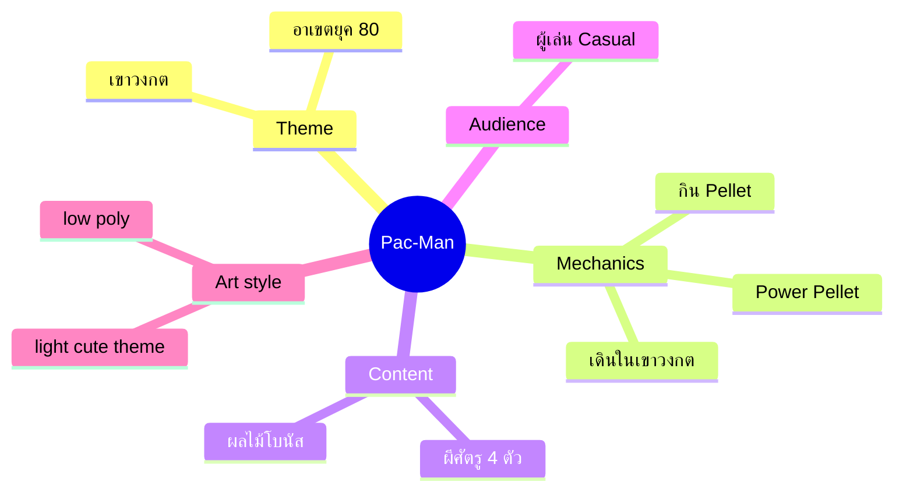
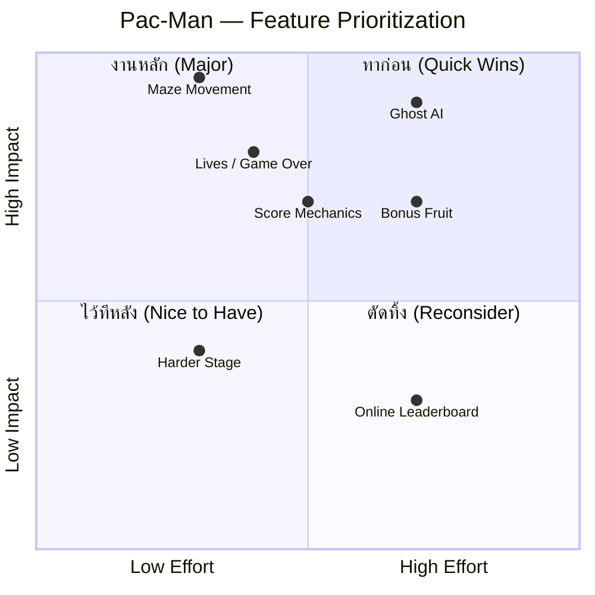
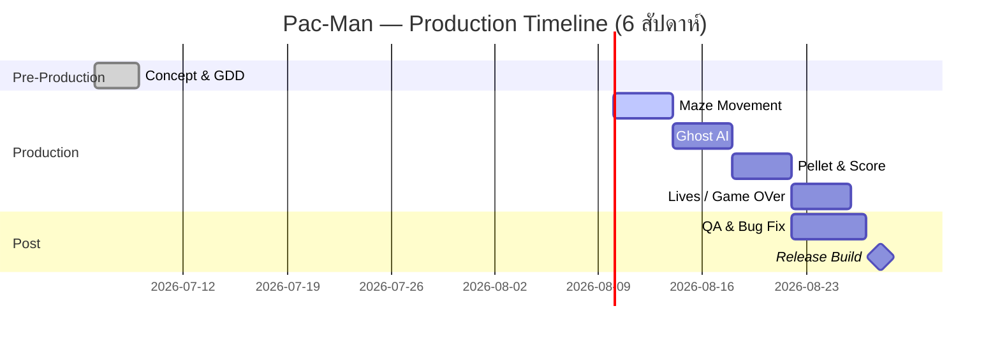

```mermaid

mindmap
root((Pac-Man))
	Theme
	 เขาวงกต
	 อาเขตยุค 80
	Mechanics
	 เดินในเขาวงกต
	 กิน Pellet
	 Power Pellet
	Content
	 ผีศัตรู 4 ตัว
	 ผลไม้โบนัส
	Audience
	 ผู้เล่น Casual
	Art style
	 low poly
	 light cute theme
```



```mermaid
 
quadrantChart
title Pac-Man — Feature Prioritization
x-axis Low Effort --> High Effort
y-axis Low Impact --> High Impact
quadrant-1 "ทาก่อน (Quick Wins)"
quadrant-2 "งานหลัก (Major)"
quadrant-3 "ไว้ทีหลัง (Nice to Have)"
quadrant-4 "ตัดทิ้ง (Reconsider)"
Maze Movement: [0.3, 0.95]
Ghost AI: [0.7, 0.9]
Online Leaderboard: [0.7, 0.3]
Bonus Fruit: [0.7, 0.7]
Harder Stage: [0.3, 0.4]
Lives / Game Over: [0.4, 0.8]
Score Mechanics: [0.5, 0.7]
```



```mermaid
gantt
	title Pac-Man — Production Timeline (6 สัปดาห์)
	dateFormat YYYY-MM-DD
	section Pre-Production
	Concept & GDD :done, p1, 2026-07-06, 3d
	section Production
	Maze Movement :active, p1, after c1, 4d
	Ghost AI : p2, after p1, 4d
	Pellet & Score : p3, after p2, 4d
	Lives / Game OVer : p4, after p3, 4d
	section Post
	QA & Bug Fix : q1, after p3, 5d
	Release Build :milestone, m1, after q1, 2d

```


```

```


```

```

```

```

```

```

```

```
